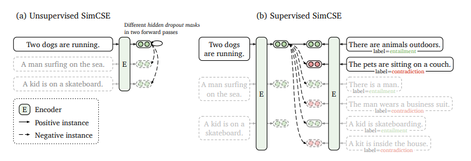

# 🍊 FinCSE-Multilingual
- **Multilingual Financial SimCSE** for searching financial/economical sentences.
- Fine-tuned on financial sentence pairs in six languages (KO, EN, ZN, JA, VI, ID), while remaining functional for other pre-trained languages.
- Reference : [SimCSE Paper](https://aclanthology.org/2021.emnlp-main.552/), [Original Code](https://github.com/princeton-nlp/SimCSE)


## 1. Model
- The FinCSEs are built upon multilingual PLMs, such as **mBERT** and **XLM-RoBERTa**.
- The FinCSE code in this repository is not derived from the original SimCSE code but is newly implemented.



## 2. Training Data
- The FinCSEs are fine-tuned using the '[Financial Domain Multilingual Parallel Corpus (금융 분야 다국어 병렬 말뭉치 데이터)](https://aihub.or.kr/aihubdata/data/view.do?currMenu=&topMenu=&aihubDataSe=data&dataSetSn=71782)' provided by AI HUB in South Korea.
- In this corpus, approximately **2.5 million English, Chinese, Japanese, Vietnamese**, and **Indonesian** sentences in the financial domain are paired with their corresponding **Korean** sentences.
```
(KO) 이처럼 금융상품의 경우 판매단계에서 금융회사의 ... 상품의 권유는 기본이고 필수라 할 것이다.
(ZN) 像这样，金融商品在销售阶段，提供金融公司适当的信息和推荐适合金融消费者的商品是基本，也是必须的.
```
- Since this corpus doesn't have similarity scores like a general STS dataset, performance evaluation is based on a **sentence retrieval** task, which searches for corresponding sentences in other languages.

&nbsp;&nbsp; (※ Note that this corpus is authorized only for individuals with South Korean citizenship.)


## 3. Implementation
You can fine-tune your FinCSE model using your own parallel sentence data.

**(1) Preparing Dataset**
- The dataset must be placed in the **'data'** directory and organized in the following structure.
- The headers and the following parallel sentences must be delimited with '\t' (tab-separated).
```
sent0  sent1
(...)  (...)
```

**(2) Fine-tuning**
- Fine-tune your FinCSE by executing the shell script **'run_train.sh'** in the **'train'** directory.
- You can modify the base model, dataset path, or hyperparameters in the shell script.
```
cd train
sh run_train.sh
```

**(3) Evaluation**
- Evaluate your FinCSE by executing the shell script **'run_eval.sh'** in the **'evaluation'** directory.
- You can modify the model to be evaluated, the dataset path, or the hyperparameters in the shell script.
```
cd evaluation
sh run_eval.sh
```

**(4) Inference**
- Perform inference by executing the shell script **'run_sentence_retrieval.sh'** in the **'evaluation'** directory.
- Note that the Faiss index and the pickle file of sentences are required to perform inference.
```
cd evaluation
sh run_sentence_retrieval.sh
```

## 4. Checkpoints
- You can use FinCSE models based on mBERT and XLM-RoBERTa by downloading them from **HuggingFace**.
  - [fincse-multilingual-bert-cased](https://huggingface.co/snumin44/fincse-multilingual-bert-cased)  
  - [fincse-multilingual-xlm-roberta-base](fincse-multilingual-xlm-roberta-base)
  - [fincse-multilingual-xlm-roberta-large](https://huggingface.co/snumin44/fincse-multilingual-xlm-roberta-large)

- The performance of these FinCSE models on financial **sentence retrieval** task is as follows. (This performance is evaluated using 50,000 samples from the dataset, which were not used in the fine-tuning.)

||FinCSE-mbert-cased|FinCSE-xlm-roberta-base|FinCSE-xlm-roberta-large|
|:---:|:---:|:---:|:---:|
|**ACC@1**|97.14|97.24|97.75|
|**ACC@5**|98.75|98.76|98.86|
|**ACC@10**|98.87|98.88|98.91|

(※ It is recommended to use the FinCSE model based on XLM-RoBERTa, as the mBERT-based model is unstable.)


## 5. Examples
- Query : 중국 생성형 AI 기업 현황 (= Status of generative AI companies in China)
- Texts :

||Text|Translation|
|:---:|:---:|:---:|
|**EN**|Experts predict that the U.S. Federal Reserve will lower interest rates by 0.25 percentage points this month, predicting that interest rates will fall by more than 0.5 percentage points in total within this year.|Experts predict that the U.S. Federal Reserve will lower interest rates by 0.25 percentage points this month, predicting that interest rates will fall by more than 0.5 percentage points in total within this year.|
|**ZN**|铁矿石是高度依赖中国需求的原材料，中国占各矿业公司出口的70%。|Iron ore is a raw material that is highly dependent on China's demand, with China accounting for 70% of exports from mining companies.|
|**JA**|オラクルは今年の大型技術株のうち、株価上昇率が人工知能（ＡＩ）半導体大将主であるＮＶＩＤＩＡの１３９％上昇率を除けば最も高い。|Oracle's stock price increase is the second highest among major tech stocks this year, after NVIDIA, the leader in AI semiconductors, with a 139% increase.|
|**VI**|NYT chỉ ra rằng điểm yếu của ngành công nghiệp Trung Quốc là LLM và hầu hết các chương trình mà các công ty Trung Quốc đưa ra dưới dạng AI tổng hợp trên thực tế đều được nhập khẩu từ Mỹ và được cải tiến.|The New York Times points out that the weakness of China's industry lies in Large Language Models (LLMs), and that most of the programs offered by Chinese companies in the form of generative AI are actually imported from the U.S. and then improved upon.|
|**ID**|Harga saham Trump Media, perusahaan induk Truth Social, perusahaan layanan jejaring sosial (SNS) yang didirikan oleh mantan calon presiden AS dari Partai Republik Donald Trump, anjlok lebih dari 10%.|The stock price of Trump Media, the parent company of Truth Social, the social networking service (SNS) founded by former U.S. presidential candidate from the Republican Party, Donald Trump, plunged by more than 10%.|
  


```python
import numpy as np
from transformers import AutoModel, AutoTokenizer

model_path = 'snumin44/fincse-multilingual-xlm-roberta-base'
model = AutoModel.from_pretrained(model_path)
tokenizer = AutoTokenizer.from_pretrained(model_path)

query = '중국 생성형 AI 기업 현황'

targets = [
    "Experts predict that the U.S. Federal Reserve will lower interest rates by 0.25 percentage points this month, predicting that interest rates will fall by more than 0.5 percentage points in total within this year.",
    "铁矿石是高度依赖中国需求的原材料，中国占各矿业公司出口的70%。",
    "オラクルは今年の大型技術株のうち、株価上昇率が人工知能（ＡＩ）半導体大将主であるＮＶＩＤＩＡの１３９％上昇率を除けば最も高い。",
    "NYT chỉ ra rằng điểm yếu của ngành công nghiệp Trung Quốc là LLM và hầu hết các chương trình mà các công ty Trung Quốc đưa ra dưới dạng AI tổng hợp trên thực tế đều được nhập khẩu từ Mỹ và được cải tiến.",
    "Harga saham Trump Media, perusahaan induk Truth Social, perusahaan layanan jejaring sosial (SNS) yang didirikan oleh mantan calon presiden AS dari Partai Republik Donald Trump, anjlok lebih dari 10%."
]

query_feature = tokenizer(query, return_tensors='pt')
query_outputs = model(**query_feature, return_dict=True)
query_embeddings = query_outputs.pooler_output.detach().numpy().squeeze()

def cos_sim(A, B):
    return np.dot(A, B) / (np.linalg.norm(A) * np.linalg.norm(B))

for idx, target in enumerate(targets):
    target_feature = tokenizer(target, return_tensors='pt')
    target_outputs = model(**target_feature, return_dict=True)
    target_embeddings = target_outputs.pooler_output.detach().numpy().squeeze()
    similarity = cos_sim(query_embeddings, target_embeddings)
    print(f"Similarity between query and target {idx}: {similarity:.4f}")
```
```

```

## Citing
```

```
